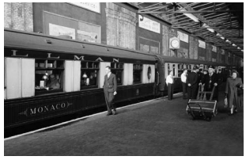
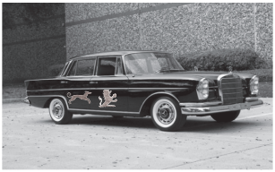

Philip Sletherby settled himself down in an almost empty railway carriage, with the pleasant consciousness of being **embarked** on an agreeable and profitable pilgrimage. He was bound for Brill Manor, the country residence of his newly achieved acquaintance, Mrs. Saltpen-Jago. *Honoria Saltpen-Jago was a person of some social importance in London, of considerable importance and influence in the county of Chalkshire. The county of Chalkshire, or, at any rate, the eastern division of it, was of immediate personal interest to Philip Sletherby; it was held for the Government in the present Parliament by a gentleman who did not intend to seek re-election, and Sletherby was under serious consideration by the party managers as his possible successor, and with luck, the seat might be held. The Saltpen-Jago influence was not an item which could be left out of consideration, and the political aspirant had been delighted at meeting Honoria at a small and friendly luncheon-party, still more gratified when she had asked him down to her country house for the following Friday-to-Tuesday. He was obviously ‘on approval’, and if he could secure the goodwill of his hostess he might count on her nominating him as an assured thing. If he failed to find favour in her eyes — well, the local leaders would probably cool off in their embryo enthusiasm for him .

Among the passengers dotted about on the platform, awaiting their respective trains, Sletherby **espied** a club acquaintance, and called him up to the carriage-window for a chat. “Oh, you’re staying with Mrs. Saltpen-Jago for the week-end, are you? I expect you’ll have a good time; she has the reputation of being an excellent hostess. She’ll be useful to you, too, if that Parliamentary project — hullo, you’re off. Good-bye.”

Sletherby waved good-bye to his friend, pulled up the window, and turned his attention to the magazine lying on his lap. He had scarcely glanced at a couple of pages, however, when a smothered curse caused him to glance hastily at the only other occupant of the carriage. His travelling companion was a young man of about two-and-twenty, with dark hair, fresh complexion, and the blend of smartness and disarray that marks the costume of a ‘nut’ who is bound on a rustic holiday. He was engaged in searching furiously and **ineffectually** for some elusive or non-existent object; from time to time he dug a sixpenny bit out of a waistcoat pocket and stared at it **ruefully,** then recommenced the futile searching operations. A cigarette-case, matchbox, latchkey, silver pencil case, and railway ticket were turned out on to the seat beside him, but none of these articles seemed to afford him satisfaction; he cursed again, rather louder than before. The vigorous **pantomime** did not draw forth any remark from Sletherby, who resumed his scrutiny of the magazine.  

“I say!” exclaimed a young voice presently, “didn’t I hear you say you were going down to stay with Mrs. Saltpen-Jago at Brill Manor? What a coincidence! My *mater, you know. I’m coming on there on Monday evening, so we shall meet. I’m quite a stranger; haven’t seen the mater for six months at least. I was away yachting last time she was in Town. I’m Bertie, the second son, you know. I say, it’s an awfully lucky coincidence that I should run across someone who knows the mater just at this particular moment. I’ve done a damned awkward thing.” 

“You’ve lost something, haven’t you?” said Sletherby.  

 

“Not exactly, but left behind, which is almost as bad; just as inconvenient, anyway. I’ve come away without my sovereign-purse, with four **quid** in it, all my worldly wealth for the moment. It was in my pocket all right, just before I was starting, and then I wanted to seal a letter, and the sovereign-purse happens to have my crest on it, so I whipped it out to stamp the seal with, and, like a double-distilled idiot, I must have left it on the table. I had some silver loose in my pocket, but after I’d paid for a taxi and my ticket I’d only got this forlorn little six pence left. I’m stopping at a little country inn near Brondquay for three days’ fishing; not a soul knows me there, and my week-end bill, and tips, and cab to and from the station, and my ticket on to Brill, that will mount up to two or three quid, won’t it? If you wouldn’t mind lending me two pound ten, or three for preference, I shall be awfully obliged. It will pull me out of no end of a hole.” 

 

 “I think I can manage that,” said Sletherby, after a moment’s hesitation 

 “Thanks awfully. It’s jolly good of you. What a lucky thing for me that I should have chanced across one of the mater’s friends. It will be a lesson to me not to leave my **exchequer** lying about anywhere, when it ought to be in my pocket. I suppose the moral of the whole thing is don’t try and convert things to purposes for which they weren’t intended. Still, when a sovereign-purse has your **crest** on it–”

 “What is your crest, by the way?” Sletherby asked, carelessly. 

 

 “Not a very common one,” said the youth; “a demi-lion holding a cross-crosslet in its paw.” 

 

 “When your mother wrote to me, giving me a list of trains, she had, if I remember rightly, a greyhound *courant on her notepaper,” observed Sletherby. There was a tinge of coldness in his voice. 
  
    “That is the Jago crest,” responded the youth promptly; “the demi-lion is the Saltpen crest. We have the right to use both, but I always use the demi-lion, because, after all, we are really Saltpens.” 

 

 There was silence for a moment or two, and the young man began to collect his fishing **tackle** and other belongings from the rack. 

 

 “My station is the next one,” he announced.  

 

“I’ve never met your mother,” said Sletherby suddenly, “though we’ve corresponded several times. My introduction to her was through political friends. Does she resemble you at all in feature? I should rather like to be able to pick her out if she happened to be on the platform to meet me.” 

 

 “She’s supposed to be like me. She has the same dark brown hair and high colour; it runs in her family. I say, this is where I get out.” 

 

 “Good-bye,” said Sletherby  

 

“You’ve forgotten the three quid,” said the young man, opening the carriage door and pitching his suit-case on to the platform.  

 

“I’ve no intention of lending you three pounds, or three shillings,” said Sletherby severely.  

 

“But you said–”  

 

“I know I did. My suspicions hadn’t been roused then, though I hadn’t necessarily swallowed your story. The **discrepancy** about the crests put me on my guard, notwithstanding the really brilliant way in which you accounted for it. Then I laid a trap for you; I told you that I had never met Mrs. Saltpen-Jago. As a matter of fact I met her at lunch on Monday last. She is a pronounced blonde. 

The train moved on, leaving the **soi-disant** cadet of the Saltpen-Jago family cursing furiously on the platform. 

 

 “Well, he hasn’t opened his fishing expedition by catching a flat,” chuckled Sletherby. He would have an entertaining story to recount at dinner that evening, and his clever little trap would earn him applause as a man of resource and **astuteness**. He was still telling his adventure in imagination to an attentive audience of dinner guests when the train drew up at his destination. On the platform he was greeted **sedately** by a tall footman, and noisily by Claude People, K.C., who had apparently travelled down by the same train 

“Hullo, Sletherby! You spending the week-end at Brill? Good. Excellent. We’ll have a round of golf together to-morrow; I’ll give you your revenge for Hoylake. Not a bad course here, as inland courses go. Ah, here we are; here’s the car waiting for us, and very nice, too!” 

 

 The car which won the K.C.’s approval was a **sumptuous**-looking vehicle, which seemed to embody the last word in elegance, comfort, and locomotive power. Its graceful lines and symmetrical design masked the fact that it was an enormous wheeled structure, combining the features of a hotel lounge and an engine-room. 

 

 “Different sort of vehicle to the post-**chaise** in which our grandfathers used to travel, eh?” exclaimed the lawyer appreciatively. And for Sletherby’s benefit he began running over the chief points of perfection in the fitting and mechanism of the car.  

 

Sletherby heard not a single word, noted not one of the details that were being **expounded** to him. His eyes were fixed on the door panel, on which were displayed two crests: a greyhound courant and a demi-lion holding in its paw a cross-crosslet.
 

The K.C. was not the sort of man to notice an absorbed silence on the part of a companion. He had been silent himself for nearly an hour in the train, and his tongue was making up for lost time. Political gossip, personal anecdote, and general observation flowed from him in an uninterrupted stream as the car sped along the country roads; from the inner history of the Dublin labour troubles and the private life of the Prince Designate of Albania he progressed with an easy volubility to an account of an alleged happening at the ninth hole at Sandwich, and a verbatim report of a remark made by the Duchess of Pathshire at a Tango tea. Just as the car turned in at the Brill entrance gates the K.C. captured Sletherby’s attention by switching his remarks to the personality of their hostess.

“Brilliant woman, level-headed, a clear thinker, knows exactly when to take up an individual or a cause, exactly when to let him or it drop. Influential woman, but spoils herself and her chances by being too restless. No repose. Good appearance, too, till she made that idiotic change.” 

 

 “Change?” queried Sletherby, “what change?”  

 

“What change? You don’t mean to say– Oh, of course, you’ve only known her just lately. She used to have beautiful dark brown hair, which went very well with her fresh complexion; then one day, about five weeks ago, she electrified everybody by appearing as a brilliant blonde. Quite ruined her looks. Here we are. I say, what’s the matter with you? You look rather ill.” 

**About the Author**

**Hector Hugh Munro** (18 December 1870 – 14 November 1916), better known by the pen name Saki, and also frequently as H. H. Munro, was a British writer whose witty, mischievous and sometimes macabre stories satirize Edwardian society and culture. He is considered a master of the short story, and often compared to O. Henry. Besides his short stories he wrote a full-length play, The Watched Pot, in collaboration with Charles Maude. 
