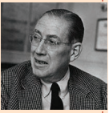

One infant grows up and becomes a jockey,
Another plays basketball or **hockey**,
This one the **prize ring** hates to enter
That one becomes a **tackle** or **center**,
I am just glad as glad can be
That I am not them, that they are not me.

With all my heart I do admire
Athletes who sweat for fun or hire,
Who take the field in **gaudy pomp**,
And **maim** each other as they **romp**,
My **limp** and **bashful** spirit feeds
On other people’s heroic deeds.

Now A runs ninety yards to score,
B knocks the champion to the floor,
Cracking vertebrae and spines,
**Lashes** his **steed** across the line,
You’d think my ego it would please
To **swap** positions with one of these

Well, ego it might be pleased enough,
But **zealous** athletes play so rough
They do not ever in their dealings
Consider one another’s feelings.
I’m glad that when my struggle begins
‘Twixt **prudence** and ego, prudence wins.

When swollen eye meets **gnarled** fist
When snaps the knee, and cracks the wrist,
When officialdom demands,
Is there a doctor in the stands?
My soul in true thanksgiving speaks
For this modest of **physiques**.

“Athletes, **I’ll drink to you**
Or eat with you,
Or anything except compete with you,
Buy tickets worth their radium,
To watch you **gambol** in the stadium,
And reassure myself anew
That you are not me and I’m not you”.

**About the Author**

**Frederic Ogden Nash** (August 19, 1902 – May 19, 1971) was an American poet well known for his light verse, of which he wrote over 500 pieces. With his unconventional rhyming schemes, he was declared the country’s best-known producer of humorous poetry. His light verse even earned him a place on a postage stamp. 