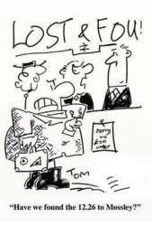

A list of articles lost by railway travellers and now on sale at a great London station has been published, and many people who read it have been astonished at the absentmindedness of their fellows. If statistical records were available on the subject, however, I doubt whether it would be found that absent

mindedness is common. It is the efficiency rather than the inefficiency of human memory that compels my wonder. Modern man remembers even telephone numbers. He remembers the addresses of his friends. He remembers the dates of good **vintages**.

He remembers appointments for lunch and dinner. His memory is crowded with the names of actors and actresses and cricketers and footballers and murderers. He can tell you what the weather was like in a long-past August and the name of the provincial hotel at which he had a vile meal during the summer. In his ordinary life, again, he remembers almost everything that he is expected to remember. How many men in all London forget a single item of their clothing when dressing in the morning? Not one in a hundred. Perhaps not one in ten thousand. How many of them forget to shut the front door when leaving the house? Scarcely more. And so it goes on through the day, almost everybody remembering to do the right things at the right moment till it is time to go to bed, and then the ordinary man seldom forgets to turn off the lights before going upstairs.

There are, it must be admitted, some matters in regard to which the memory works with less than its usual perfection. It is only a very methodical man, I imagine, who can always remember to take the medicine his doctor has prescribed for him. This is the more surprising because medicine should be one of the easiest things to remember. As a rule, it is supposed to be taken before during, or after meals and the meal itself should be a reminder of it. The fact remains, however, that few but the moral giants remember to take their medicine regularly. Certain psychologists tell us that we forget things because we wish to forget them, and it may be that it is because of their **antipathy** to pills and potions; that many people fail to remember them at the appointed hours.

This does not explain, however, how it is that a life-long devotee of medicines like myself is as forgetful of them as those who take them most unwillingly. The very prospect of a new and widely advertised cure-all delights me. Yet, even if I have the stuff in my pockets, I forget about it as soon as the hour approaches at which I ought to swallow it. Chemists make their **fortunes** out of the medicines people forget to take.

 The commonest form of forgetfulness, I suppose, occurs in the matter of posting letters. So common is it that I am always **reluctant** to trust a departing visitor to post an important letter. So little do I rely on his memory that I put him on his oath before handing the letter to him. As for myself, anyone who asks me to post a letter is a poor judge of character. Even if I carry the letter in my hand I am always past the first pillar-box before I remember that I ought to have posted it. Weary of holding it in my hand, I then put it for safety into one of my pockets and forget all about it. After that, it has an unadventurous life till a long chain of circumstances leads to a number of embarrassing questions being asked, and I am compelled to produce the evidence of my guilt from my pocket. This, it might be thought, must be due to a lack of interest in other people’s letters; but that cannot be the explanation, for I forget to post some even of the few letters that I myself remember to write.

As for leaving articles in trains and in taxies, I am no great **delinquent** in such matters. I can remember almost anything except books and walking-sticks and I can often remember even books. Walkingsticks I find it quite impossible to keep. I have an old-fashioned taste for them, and I buy them frequently but no-sooner do I pay a visit to a friend’s house or go a journey in a train, than another stick is on its way into the world of the lost. I dare not carry an umbrella for fear of losing it. To go through life without ever having lost an umbrella- has even the grimmestjawed umbrella-carrier ever achieved this?

 Few of us, however, have lost much property on our travels through forgetfulness. The ordinary man arrives at his destination with all his bags and trunks safe. The list of articles lost in trains during the year suggests that it is the young rather than the adult who forget things, and that sportsmen have worse memories than their ordinary seriousminded fellows. A considerable number of footballs and cricket-bats, for instance, were forgotten. This is easy to understand, for boys, returning from the games, have their imaginations still filled with a vision of the playing-field, and their heads are among the stars - or their hearts in their boots - as they recall their **exploits** or their errors. They are **abstracted** from the world outside them. Memories prevent them from remembering to do such small **prosaic** things as take the ball or the bat with them when they leave the train.

For the rest of the day, they are citizens of dreamland. The same may be said, no doubt, of anglers who forget their fishing-rods. Anglers are generally said - I do not know with what justification- to be the most imaginative of men, and the man who is inventing magnificent lies on the journey home after a day’s fishing is bound to be a little absent-minded in his behaviour. The fishing-rod of reality is forgotten by him as he day-dreams over the fears of the fishing-rod of Utopia. His loss of memory is really a tribute to the intensity of his enjoyment in thinking about his day’s sport. He may forget his fishing-rod, as the poet may forget to post a letter, because his mind is filled with matter more glorious. 

Absent-mindedness of this kind seems to me all but a virtue. The absentminded man is often a man who is making the best of life and therefore has no time to remember the **mediocre**.Who would have trusted Socrates or Coleridge to post a letter? They had souls above such things.

 The question whether the possession of a good memory is altogether desirable has often been discussed, and men with **fallible** memories have sometimes tried to make out a case for their superiority. A man, they say, who is a perfect remembering machine is seldom a man of the first intelligence, and they quote various cases of children or men who had marvellous memories and who yet had no intellect to speak of. I imagine, however, that on the whole the great writers and the great composers of music have been men with exceptional powers of memory. The poets I have known have had better memories than the stockbrokers I have known. Memory, indeed, is half the substance of their art.

On the other hand, statesmen seem to have extraordinarily bad memories. Let two statesmen attempt to recall the same event - what happened, for example, at some Cabinet meeting - and each of them will tell you that the other’s story is so inaccurate that either he has a memory like a **sieve** or is an **audacious** perverter of the truth. The frequency with which the facts in the autobiographies and speeches of statesmen are challenged, suggests that the world has not yet begun to produce ideal statesmen-men who, like great poets, have the genius of memory and of intellect combined.

At the same time, ordinarily good memory is so common that we regard a man who does not possess it as **eccentric**. I have heard of a father who, having offered to take the baby out in a perambulator, was tempted by the sunny morning to pause on his journey and slip into a public-house for a glass of beer. Leaving the perambulator outside, he disappeared through the door of the saloon bar. A little later, his wife had to do some shopping which took her past the public-house, where to her horror, she discovered her sleeping baby. **Indignant** at her husband’s behaviour, she decided to teach him a lesson.

She wheeled away the perambulator, picturing to herself his terror when he would come out and find the baby gone. She arrived home, anticipating with angry relish the white face and **quivering** lips that would soon appear with the news that the baby had been stolen. What was her **vexation**, however, when just before lunch her husband came in smiling cheerfully and asking: “Well, my dear, what’s for lunch today?” having forgotten all about the baby and the fact that he had taken it out with him. How many men below the rank of a philosopher would be capable of such absent-mindedness as this? Most of us, I fear, are born with prosaically efficient memories. If it were not so, the institution of the family could not survive in any great modern city.

**About The Author**

**Robert Wilson Lynd (1879 – 1949)**, an Irish writer,
is one of the greatest essayists of the 20th Century.
He began his career as a journalist. He penned
numerousarticles for the leading newspapers and
magazines like Daily News, The New Statesman and
Nation. He wrote under the pseudonym ‘YY.’ His essays
cover a wide range of simple and interesting topics. 
They are humorous, delightful, ironical and satirical.
Robert Lynd was awarded with an honorary literary
Doctorateby Queen’s University, Belfast in 1947. Hewas
also honoured by the Royal Society of Literature with
a silver medal and by The Sunday Timeswith a gold
medal for Belles Lettres. In his essay ‘Forgetting’,
Robert Lynd takes a humorous look at the nature and
effects of forgetfulness.
