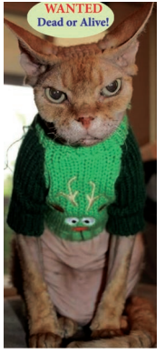

Macavity’s a Mystery Cat: he’s called the Hidden Paw
For he’s the master criminal who can **defy** the Law.
He’s the **bafflement** of **Scotland Yard**, the **Flying** Squad’s despair:
For when they reach the scene of crime — Macavity’s not there!

Macavity, Macavity, there’s no one like Macavity,
He’s broken every human law, he breaks the law of gravity.
His powers of **levitation** would make a **fakir** stare,
And when you reach the scene of crime — Macavity’s not there!

You may seek him in the basement, you may look up in the air —
But I tell you once and once again, Macavity’s not there!
Macavity’s a **ginger cat**, he’s very tall and thin;
You would know him if you saw him, for his eyes are sunken in. 

His brow is deeply lined with thought, his head is highly domed;
His coat is dusty from neglect, his whiskers are uncombed.
He sways his head from side to side, with movements like a snake;
And when you think he’s half asleep, he’s always wide awake.

Macavity, Macavity, there’s no one like Macavity,
For he’s a **fiend** in **feline** shape, a monster of **depravity**.
You may meet him in a by-street, you may see him in the square —
But when a crime’s discovered, then Macavity’s not there!

He’s outwardly respectable. (They say he cheats at cards.)
And his footprints are not found in any file of Scotland Yard’s.
And when the **larder’s** looted, or the jewel-case is **rifled**,
Or when the milk is missing, or another **Peke’s** been **stifled**,

Or the greenhouse glass is broken, and the **trellis** past repair
Ay, there’s the wonder of the thing! Macavity’s not there!
And when the Foreign Office find a Treaty’s gone astray,
Or the **Admiralty** lose some plans and drawings by the way

There may be a scrap of paper in the hall or on the stair
But it’s useless to investigate, Macavity’s not there!
And when the loss has been disclosed, the Secret Service say:
‘It must have been Macavity!’ but he’s a mile away.

You’ll be sure to find him resting, or a licking of his thumbs,
Or engaged in doing complicated long division sums.
Macavity, Macavity, there’s no one like Macavity,
There never was a Cat of such **deceitfulness** and **suavity**.

He always has an **alibi**, and one or two to spare:
At whatever time the deed took place, MACAVITY WASN’T THERE!
And they say that all the Cats whose wicked deeds are widely known,
(I might mention **Mungojerrie**, I might mention **Griddlebone**)
Are nothing more than agents for the Cat who all the time
Just controls their operations: the **Napoleon of Crime**.

**About the Author**

 **defy **– to resist or to challenge bafflement – total confusion Scotland Yard – the headquarters of London Metropolitan Police Service Flying Squad – a police force ready to plunge into action levitation – the action of rising and floating in air fakir – a holy person who lives on alms and has the power to levitate ginger – a light brownish – orange colour fiend – demon feline – cat depravity – evil quality larder – cupboard for storing food rifle – ransack to steal Peke – a Pekinese dog Thomas Stearns Eliot (1888 – 1965) was an essayist, a critic, a playwright and a pioneering poet of the twentieth century. He attended Smith Academy in St. Louis and then Milton Academy in Massachusetts. He graduated from Harvard University and then left for France and the Sorbonne to study philosophy. He returned to Harvard and deepened his knowledge by reading Indian philosophy and studying Sanskrit. He also finished his advanced degree at Harvard. Some of his popular poems include ‘The Wasteland’, ‘Love Song of J. Alfred Prufrock’, ‘Ash Wednesday’, ‘Four Quartets’, ‘Journey of the Magi’, ‘After Strange Gods’ and ‘Naming of Cats’. He won the Order of Merit and received the Nobel Prize for Literature in the year 1948.
