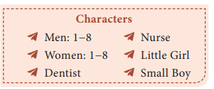
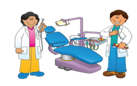

**Scene:**
 When the curtain rises the following characters are seated in a dentist’s waiting room: Women 1−8 and Men 1−8. Some of them are reading magazines or newspapers. Man 4 has a rough bandage tied round his jaw. He is holding the bandage and **groaning**. Man 3, Woman 5 and Woman 6 are just entering the waiting-room.

 **Woman 5**:
 We’ll have some time to wait before the dentist sees us, dear.

**Woman 5:**
 But I’ll show you some of my holiday photographs to pass the time.

**(Man 3, Woman 5, and Woman 6 sit. Woman 5 takes a packet of photographs from her handbag. Throughout the play she concentrates on showing her photographs.)**

**Man 5:**
 What time do you make it, Jack?

**Man 6:**
 Almost eight-thirty. The dentist should be along any moment now.

**Woman 6:**
 Isn’t it a dreadful hour of the morning to see a Dentist! I’m not half awake yet.

**Man 5:**
 I hope he won’t be long. I’m going to be late for work anyway.

**Man 6:**
Something should be done about dental hours. I’ve always said so and I’ll go on saying so.

**(Enter Nurse.)**

**Woman 6:**
Good, the dentist shouldn’t be long now. 

**Woman 5:**
 And this is one of the boarding houses at Waddling-on-sea. Our boarding house. Those are the steps I fell up. We nearly died laughing.

** Woman 6:** 
It looks quite a nice place.

**Woman 5:**
 Oh, it was, it was. And the landlady was a dear.

**(Woman 5 shows another photograph.)**

 This is one of hers. You can’t quite see her face. You see, my finger got in the way, but she has such a nice face.

**Woman 6:**
 I’m sure she has.

**(Enter Woman 7 and the Little Girl.)**

**Woman 7:**
 Oh, do come along, Dorothea.

**Little Girl:**
 I don’t want to see the dentist. I won’t! I won’t! 

**Woman 7:**
 Now, Dorothea, remember what your daddy said. If you won’t have your teeth seen to, no more ice-lollies.

**Little Girl:**
 I don’t want any ice-lollies. 

**(The Little Girl is dragged to her seat by Woman 7. She sits weeping. Man 4 groans loudly.)**

**Woman 4:**
 Here’s the dentist.

**Woman 3:**
 And about time, too.
