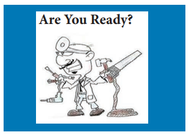

**Scene:**
 When the curtain rises the following characters are seated in a dentist’s waiting room: Women 1−8 and Men 1−8. Some of them are reading magazines or newspapers. Man 4 has a rough bandage tied round his jaw. He is holding the bandage and **groaning**. Man 3, Woman 5 and Woman 6 are just entering the waiting-room.

 **Woman 5**:
 We’ll have some time to wait before the dentist sees us, dear.

**Woman 5:**
 But I’ll show you some of my holiday photographs to pass the time.

**(Man 3, Woman 5, and Woman 6 sit. Woman 5 takes a packet of photographs from her handbag. Throughout the play she concentrates on showing her photographs.)**

**Man 5:**
 What time do you make it, Jack?

**Man 6:**
 Almost eight-thirty. The dentist should be along any moment now.

**Woman 6:**
 Isn’t it a dreadful hour of the morning to see a Dentist! I’m not half awake yet.

**Man 5:**
 I hope he won’t be long. I’m going to be late for work anyway.

**Man 6:**
Something should be done about dental hours. I’ve always said so and I’ll go on saying so.

**(Enter Nurse.)**

**Woman 6:**
Good, the dentist shouldn’t be long now. 

**Woman 5:**
 And this is one of the boarding houses at Waddling-on-sea. Our boarding house. Those are the steps I fell up. We nearly died laughing.

**Woman 6:** 
It looks quite a nice place.

**Woman 5:**
 Oh, it was, it was. And the landlady was a dear.

**(Woman 5 shows another photograph.)**

 This is one of hers. You can’t quite see her face. You see, my finger got in the way, but she has such a nice face.

**Woman 6:**
 I’m sure she has.

**(Enter Woman 7 and the Little Girl.)**

**Woman 7:**
 Oh, do come along, Dorothea.

**Little Girl:**
 I don’t want to see the dentist. I won’t! I won’t! 

**Woman 7:**
 Now, Dorothea, remember what your daddy said. If you won’t have your teeth seen to, no more ice-lollies.

**Little Girl:**
 I don’t want any ice-lollies. 

**(The Little Girl is dragged to her seat by Woman 7. She sits weeping. Man 4 groans loudly.)**

**Woman 4:**
 Here’s the dentist.

**Woman 3:**
 And about time, too.

**Enter Dentist.)**

**Dentist:**
 Could I have the first patient, please? 

**(Exit Dentist into surgery.)**

**Woman 1:**
 That’s you, Joe. 
**(Man 1 and Woman 1 stand.)**

**Man 1:**
 Yes, that’s me. 

**Woman 1:**
 Now, make sure he pulls out the right one, Joe. 

**Man 1:**
 I will. 

**Woman 1:**
 Good-bye, Joe, I’ll wait for you. 

**(Exit Man 1 into surgery. Woman 1 sits.)**
 

**Woman 2:**
I believe the Dentist is ever so good. 

**Woman 3:**
 Yes, he took out six for Mrs. Johnstone, and she never felt a thing. 

**(Enter Woman 8 with the Small Boy.)**

**Woman 8:**
 Now Maurice, there’s nothing to be afraid of. 

**Small Boy:**
I’m not afraid.

**Woman 8 :**
Just a little pull, and ever such a **weeny** **tug**, and all the pain will be gone. 

**Small Boy:**
 There is no need to treat me like a baby. I’m not afraid of a dentist. 

**Woman 8:**
 Now sit down quietly, Maurice, and I’m sure the nice dentist won’t be long. 

**Small Boy:**
 I think I’ll get a magazine, I feel like reading. 

**(The small boy goes to the table and looks through the pile of magazines and newspapers.)**

**Woman 8:**
 All right, dear, just as you like. 

**(Woman 8 sits.)**

**Man 5:**
 I’m going to ask for **gas**. I’ll never forget the last time. 

**Man 1:**
 I knew a chap once. He asked for gas. It was the last time he ever asked for anything. 

**Man 2:**
 Is that a fact? 

**(Enter Nurse from the surgery. She walks across the stage and exits left.)**

**Man 4:**
 I shouldn’t ask for gas, or any of these drugs either. It’s unnatural I say. Give me the old-fashioned methods. 

**Man 5:**
 You can have them. I’ll have it without the pain.

**Woman 5:**
 And you’ll love this one, dear. 

**Woman 6:**
 I’m sure I will.

 **Woman 5:**
 It’s one of me riding a donkey along the sands. 

**Woman 6:**
 Oh, I say! Woman 5: Isn’t it a scream, dear? I sat on it the wrong way round, just for the laugh. 

**(Enter Nurse left, ferrying a large hammer. She crosses the stage and goes into the surgery.)**

**Man 6:**
 Was that a hammer she was carrying? 

**Man 7:**
 I’ve seen dentists use some queer tools. 

**Man 6:**
 Well, if it wasn’t a hammer, I should be attending an eye specialist and not a dentist. 

**Woman 5:**
 I hope he isn’t going to use it. 

**Man 3:**
 It’s a peculiar thing to have in a surgery. 

**(The sound of hammering is heard from the surgery. Everyone looks at the surgery door and then at one another.)**

**Woman 1:**
 Oh! Joe! My poor Joe! Oh, what will I do?

**(Standing)**

**Woman 2:**
 I shouldn’t worry. The dentist probably knows what he’s doing.

**Woman 1:**
 Yes, but does Joe? Surely he’s not hammering on poor Joe’s tooth. 

**Woman 2:**
 Now, sit down and don’t excite yourself. I’m sure Joe is quite all right. 

**(Woman 1 sits. There is more hammering from the surgery. Woman 1 is about to stand but Woman 2 restrains her.)**

**Woman 2:**
 There, there, dear, do sit down quietly. 

**Man 5:**
 I don’t like the sound of that.

**Man 4:**
 I shouldn’t worry. These dentists know what they’re doing. I hope. 

**(Nurse enters from the surgery and walks across the stage and out left. Everyone watches her in silence.)**

**Woman 7:**
 She didn’t look very worried, anyway. 

**Woman 8:**
 No, it’s the patient who worries. 

**Woman 7:**
 I say let him worry. Worry is natural. It never did anyone any harm.

**Woman 1:**
 I wish you wouldn’t talk like that, with my poor Joe in there, may be writhing in agony. 

**(Enter Nurse left. She is carrying a large pair of pliers. She walks across the stage and into the surgery. Man 4 groans and everyone groans after him. Woman 1 watches in horror. She stands as the Nurse exits into the surgery.)**

**Woman 1:**
 No, no, it can’t be true! They can’t do this to Joe. Not to my Joe. 

**(Woman 2 forces Woman 1 back into her seat.)**

**Woman 2:**
 There, there, don’t upset yourself, dear. There’s nothing to worry about. 

**(Woman 1 starts weeping and sobbing.)**
 
**Man 3:**
 A bit big, wasn’t it? 

**Man 4:**
 Nothing to what they used in the old days. I heard of a chap once the roots of whose teeth were wrapped round his jaw-bone. He was five hours in the chair. 

**Man 3:**
 None the worse for it, I’ll bet. 

**(There is a sudden screech of metal from the surgery. Woman 1 gasps with horror and is about to make a dash for the surgery door when she is dragged back by Woman 2. Man 4 groans loudly. The Small Boy and the Little Girl at the table start a fight about a magazine they both want. Woman 8 and Woman 7 attempt to separate them. Through all this noise Woman 5 is still trying to show her photographs.)**

**Little Girl:**
 It’s mine! It’s mine! 

**Small Boy:**
 No, it’s mine! I saw it first. 

**Woman 7:**
 Sit down, Dorothea. Sit down and be quiet. I’ll tell your daddy about this. Then there’ll be trouble. Really, it’s the last time I’ll bring you anywhere.

**Little Girl:**
 See if I care. Woman 6: I wish some people would keep their children under control. 

**Woman 7:**
 Well, really! 

**(At last the little girl and the small boy settle into their seats. They are both **sulking**.)

**Man 2:**
 There should be a special waiting-room for children. 

**(The metallic screech is heard again from the surgery. Fresh sobs from Woman1.)**

**Woman 1:**
 I can’t stand it. Oh, Joe! Joe! Joe! 

**(Man 4 groans.)**

**Small Boy:**
 What was that noise, Mummy? 

**Woman 8:**
 Don’t ask awkward questions, Maurice. 

**Man 7:**
 I’ll tell you, little boy. That noise was a man having a tooth out. That’s how it’s going to sound when you have yours out, only much, much louder, because then it’ll be inside your head.

**Woman 6:**
What a thing to tell a small boy! 

**Man 6:**
 Disgusting! 
**Man 7:**
 It’ll do the lad good. Bring ‘em up natural, I always say. 

**Small Boy:**
 Oh, Mummy, Mummy, take me to school! Quick, take me to school! 

**Woman 8:**
 Take you to school? What on earth do you mean? 

**Small Boy:**
 I haven’t got toothache at all. I was only joking. I just wanted to get off school. Take me to school. Mummy, please. 

**(Everyone laughs.)**

**Woman 8:**
 I’ll take you to school all right (Woman 8 takes the Small Boy by the ear. She drags him out.)  and I’ll get the headmaster to give you a good thrashing.

**(Exit Woman 8 and the Small Boy. The Small Boy is yelling.)**

**Man 5:**
 A little discipline, that’s what he wants. 
**(Woman 5 is still showing her photographs.)**

**Woman 5:**
 This one should make quite an impression on you, dear. **(There is a loud hammering from the surgery.)**

**Woman 6:**
 Yes, it does.

**(Enter Nurse from the surgery)**.

**Dentist’s Voice (off):**
 Do hurry, Nurse or we’ll never get this thing shift. 

**(Nurse walks across the stage and off left.)**

**Man 6:**
 Well, really, I don’t think I can wait. 

**(Standing)**

**Man 5:**
 Neither can I. I’ll be very late for work. 
**(Standing)**

**(Exit Man 5 and Man 6.)**

**Woman 6:**
 But surely, they can’t really be using those tools to take out a tooth. 

**Woman 4:**
 You heard what the Man said. 

**Woman 6:**
 And those men have gone, too. 

**Man 7:**
 Cowards, every one of them. They can’t take it. 

**Little Girl:**
 Mummy, I was only joking about my toothache, too. I haven’t really got one. I was only trying to get off school.

**Woman 7:**
 Nonsense, Dorothea, you know your tooth is as black as the kitchen range. You’re only trying to get out of it. 

**(The Little Girl breaks into a howl.)**

**Man 2:**
 I can’t stand howling children. I’m off. 

**(Standing)**

**Man 3:**
 And I can’t stand them either. I’m coming with you. 

**(Standing)**

**(Exit Man 2 and Man 3.)**

**Woman 7:**
 Now, see what you’ve done, Dorothea, you’ve chased those men away. 

**Little Girl:**
 They’re lucky. 

**(The Little Girl howls again. The Nurse enters, this time with a hacksaw.)**

**Woman 1:**
 Oh, Joe! Joe! He’ll never stand it. The sound of sawing always did put his teeth on edge. 

**Man 7:**
 This time the saw will be on the edge of his teeth. 

**Woman 2:**
 Oh, you horrible Man! 

**Man 7:**
 Can’t I even make a joke?

**Man 8:**
 We need something to cheer us up. 

**Woman 4:**
 Surely it’s against the law for a dentist to use a saw like that. 

**(The sound of violent sawing is heard from the surgery. Man 4 groans loudly.)

**Woman 1:**
 Oh no, Joe! No, Joe!

**(Woman 1 makes a dash for the door but is prevented from opening it by Woman 2 and Woman 6.)**

**Woman 3:**
 You really must control yourself.

**Woman 2:**
 There, there, dear. I’m sure it’s not as bad as it sounds. 

**(They place Woman 1 back in her seat.)**

**Woman 1:**
 I’m not waiting to find out. I’ve heard enough. 

**Woman 3:**
 I prefer to keep my toothache. 

**Woman 4:**
 So do I. Me too. Those pliers would never fit my mouth, anyway. It’s better than being murdered, anyway. 

**(Standing)**

**(Exit Woman 3, Woman 4 and Woman 6.)**

**Man 7:**
 Just watch them go, cowards every one of them. 

**Woman 2:**
 It’s all very well you talking this way. You don’t seem to have any nerves at all. 

**Man 7:**
 This is nothing to some of the things I’ve heard of. I could tell you things that would make your hair stand on end. There was once... 

**Woman 2:**
 I’m sure we don’t want to hear it. My hair is standing on end already. 

**(The sawing is heard again, even louder and harsher this time. Woman 1 wails and Man 4 groans.)**

**Woman 5:**
 Don’t you want to see any more of my holiday photos? 

**(Exit Man 8.)**
Well, really, how rude!

**(Woman 5 moves to Woman 7.)** 
Would you like to see some of my holiday photos?

**Woman 7:**
 Well, I don’t really… 

**Woman 5:**
 Now, now, don’t be shy. Now, this one is a bit blurred, but down in the corner you can see my sister-in-law’s little boy. 

**(Woman 7 takes the offered photograph reluctantly and looks at it vacantly. The surgery door opens and the Dentist enters. He looks very hot and bothered. He stands in the doorway.)**

**Dentist:**
 I’m fed up with this. I’m off to get someone who knows something about the job. 

**(The Dentist strides across the stage and exits left. For a moment Woman 2, Man 4, and Woman 5 sit gaping. Then Woman 1 wails, as Woman 2, Woman 7 and the Little Girl stand and make for the door left.)**

**Man 7:**
 This is the end. I’m off. 

**(There are cries of “Me too”, “So am I”, “Here I go”, etc., and all except Woman 1 and Woman 5 go out in a hurry.)**

**Woman 5:**
 Well, really, people are very rude. 

**(Woman 5 looks at the wailing Woman 1.)**
 Whatever is the matter, my dear?

**Woman 1:**
 It’s Joe! Poor Joe! Goodness knows what state he’s in now. 

**Woman 5:**
 Joe? Who’s Joe? And what’s the matter with him? 

**Woman 1:**
 I’m afraid to go in. I’m afraid to look. Joe’s my husband and that awful dentist has been working on him. He’s in there. 

**(Woman 1 points to the surgery.)**

**Woman 5:**
 Well, I don’t suppose he has come to any harm. 

**(Woman 5 sits beside Woman 1.)**
 I tell you what, dear, you need cheering up. Here, you just have a look at my holiday photos. They’re ever so cheerful. 

**(Woman 1 breaks into fresh sobs.)**

**Woman 5:**
 Oh, dear me! Where’s that very amusing one? 

**(Woman 5 looks through her photographs.)**
 I must have lost it. Ah, yes! It’ll probably be over there. 

**(Woman 5 walks across to her previous position and starts looking for the lost photograph. Woman 1 continues sobbing. Enter Man 1 from the surgery.)**

**Man 1:**
 Why, whatever is the matter, Emily? 

**Woman 1:**
 Joe, Joe, are you all right? Let me look at you, Joe!

**Man 1:**
 Of course I’m all right. Why shouldn’t I be all right? 

**Woman 1:**
 But, Joe, all that hammering and sawing. 

**Man 1:**
 Oh, that! That was only the dentist trying to force open his instrument cabinet. 

**Woman 1:**
 His cabinet? 

**Man 1:**
 Yes, you see he lost the key. 

**Woman 1:**
 So he hasn’t done anything to you, Joe! 

**Man 1:**
 Not a thing, and I can’t wait any longer this morning. I’ve made an appointment with him for this evening instead. The nurse gave me some pills to deaden the pain in the meantime. 

**Woman 1:**
 Oh, Joe, I was so upset. 

**Man 1 :**
 Well, it’s all right now, Emily, so let’s go. 

**(Woman 1 and Man 1 go out left. A moment later the Nurse enters from the surgery. She is walking across the stage when the Dentist enters left. The Dentist is waving a key.)

**Dentist:**
 I found it. Believe it or not, but it was under the telephone directory. What an awful waste of time! 

**Nurse:**
 I’m afraid the first patient couldn’t wait. However, he made an appointment for this evening.

**Dentist:**
 Fair enough. I’ll take the next patient. 

**(Dentist goes into the surgery. Nurse turns to Woman 5 who is still looking at her photographs.)**

**Nurse :**
 Now, madam, the dentist is ready. 

**(Woman 5 looks up.)**

**Woman 5:**
 Do you mean me, Miss? 

**Nurse:**
 Yes, would you step into the surgery, please? 

**(Nurse goes into the surgery.)**

**Woman 5:**
 Dear me, that long queue did move quickly, didn’t it? 

**(Woman 5 follows the Nurse into the surgery.)**     **CURTAIN**

