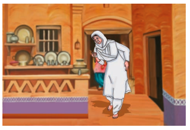

My grandmother, like everybody’s  grandmother, was an old woman. She  had been old and wrinkled for the twenty  years that I had known her. People said  that she had once been young and pretty  and had even had a husband, but that was hard to believe. My grandfather’s  portrait hung above the mantelpiece in  the drawing room. He wore a big turban  and loose fitting clothes. His long, white  beard covered the best part of his chest  and he looked at least a hundred years old.  He did not look the sort of person who  would have a wife or children. He looked  as if he could only have lots and lots of  grandchildren. As for my grandmother being young and pretty, the thought was  almost revolting. She often told us of the  games she used to play as a child. That  seemed quite **absurd** and undignified on  her part and we treated it like the **fables** of  the Prophets she used to tell us.

She had always been short and fat and slightly bent. Her face was a criss-cross of wrinkles running from everywhere to everywhere. No,we were certain she had always been as we had known her. Old, so terribly old that she could not have grown older and had stayed at the same age for twenty years. She could never have been pretty; but she was alway beautiful. She **hobbled** about the house in spotless white with one hand resting on her waist to balance her  stoop and the other telling the beads of her rosary. Her silver locks were scattered untidily over her pale, puckered face, and her lips constantly moved in inaudible 

prayer. Yes, she was beautiful. She was like the winter landscape in the mountains, an **expanse** of pure white serenity breathing peace and contentment.

 My grandmother and I were good friends. My parents left me with her when they went to live in the city and we were constantly together. She used to wake me up in the morning and get me ready for school. She said her morning prayer in a **monotonous** sing-song while she bathed and dressed me in the hope that I would  listen and get to know it by heart; I listened  because I loved her voice but never  bothered to learn it. Then she would fetch  my wooden slate which she had already  washed and plastered with yellow chalk,  a tiny earthen ink-pot and a red pen, tie  them all in a bundle and hand it to me.  After a breakfast of a thick, stale chapatti  with a little butter and sugar spread on it,  we went to school. She carried several stale chapattis with her for the village dogs.
 
 
My grandmother always went to school with me because the school was attached to the temple. The priest taught  us the alphabet and the morning prayer. While the children sat in rows on either  side of the verandah singing the alphabet or the prayer in a chorus, my grandmother  sat inside reading the scriptures. When we  had both finished, we would walk back together. This time the village dogs would  meet us at the temple door. They followed  us to our home growling and fighting with  each other for the chapatti we threw to them.
  
  
 When my parents were comfortably  settled in the city, they sent for us. That  was a turning-point in our friendship. Although we shared the same room, my grandmother no longer came to school with me. I used to go to an English school  in a motor bus. There were no dogs in the  streets and she took to feeding sparrows  in the courtyard of our city house.

As the years rolled by, we saw less of each other. For some time she continued to wake me up and get me ready for school. When came back she would ask me what the teacher had taught me. I would tell her English words and little things of western science and learning, the law of gravity Archimedes’Principle, the world being  round etc. This made her unhappy. She could not help me with my lessons. She did not believe in the things they taught at the English school and was distressed that there was no teaching about God and the scriptures. One day, I announced that we were being given music lessons. She said nothing but her silence meant disapproval.She rarely talked to me after that.

When I went up to University, I was  given a room of my own. The common  link of friendship was **snapped**. My grandmother accepted her **seclusion** with resignation. She rarely left her spinning-wheel to talk to anyone. From sunrise to sunset she sat by her wheel spinning and reciting prayers.Only in the afternoon she relaxed for a while to feed the sparrows. While she sat in the verandah breaking the bread into little bits, hundreds of  little birds collected round her creating a veritable **bedlam** of chirruping. Some

came and **perched** on her legs, others on 
her shoulders. Some even sat on her head.
She smiled but never shooed them away. 
It used to be the happiest half-hour of the 
day for her.

When I decided to go abroad for further studies, I was sure my grandmother would be upset. I would be away for five years, and at her age one could never tell. But my grandmother could. She was not even sentimental. She came to leave me at the railway station but did not talk or show any emotion. Her lips moved in prayer, her mind was lost in prayer. Her fingers were busy telling the beads of her rosary.  Silently she kissed my forehead, and when I left I cherished the moist imprint as perhaps the last sign of physical contact between us.

But that was not so. After five years I came back home and was met by her at the station She did not look a day older. She still had no time for words, and while she clasped me in her arms I could hear her reciting her prayers. Even on the first day of my arrival, her happiest moments were with her sparrows whom she fed longer and with frivolous **rebukes**.

In the evening a change came over her. She did not pray. She collected the women of the neighbourhood, got an old drum and started to sing. For several hours she thumped the sagging skins of the **dilapidated** drum and sang of the home-coming of warriors. We had to persuade her to stop to avoidoverstraining. That was the first time since I had known her that she did not pray.

The next morning she was taken ill. It was a mild fever and the doctor told us that it would go. But my grandmother thought differently. She told us that her end was near. She said that, since only a few hours before the close of the last chapter of her life she had omitted to pray, she was not going to waste any more time talking to us.

We protested. But she ignored our protests. She lay peacefully in bed praying and telling her beads. Even before we could suspect, her lips stopped moving and the rosary fell from her lifeless fingers. A peaceful **pallor** spread on her face and we knew that she was dead.

We lifted her off the bed and, as is customary, laid her on the ground and covered her with a **red shroud**. After a few hours of mourning we left her alone to make arrangements for her funeral. In the evening we went to her room with a crude stretcher to take her to be cremated. The sun was setting and had lit her room and verandah with a blaze of golden light. We stopped half-way in the courtyard. All over the verandah and in her room right up to where she lay dead and stiff wrapped in the red shroud, thousands of sparrows sat scattered on the floor. There was no chirruping. We felt sorry for the birds and my mother fetched some bread for them. She broke it into little crumbs, the way my grandmother used to, and threw it to them. The sparrows took no notice of the bread. When we carried my grandmother’s corpse off, they flew away quietly. Next morning the sweeper swept the bread crumbs into the dustbin. 

**About The Author**

**Khushwant Singh** is an Indian novelist and lawyer.
He studied at St. Stephen’s College, Delhi and King’s
college, London. He joined the Indian Foreign Service
in 1947. As a writer, he is best known for his keen
secularism, sarcasm and love for poetry. He served as
the editor of several literary and news magazines as
well as two newspapers. Khushwant Singh was awarded
with Padma Bhushan in 1974, Padma Vibhushan by the
Government of India and Sahitya Akademi Fellowship by
Sahitya Academy of India. The Mark of Vishnu, A
History of Sikhs, The Train to Pakistan, Success
Mantra, We Indians and Death at my Doorstep are some
of his brilliant works.

