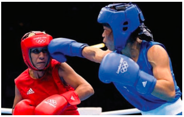
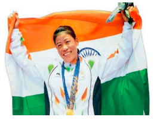
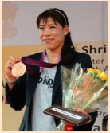

Soon after the Bangkok championship, I was selected in the 48kg category for the International Boxing Association (originally the Association Internationale de Boxe Amateur, or the AIBA) World Women’s Boxing Championships in Pennsylvania, USA, in November–December 2001. My father managed to collect only Rs 2,000 for my trip. I was both upset and very worried because I’d heard of 

how expensive things were in America. But there was nothing my parents or I could do. I spoke to Onler, one of my friends, about my problem. He invited a few students and elders, who went to meet the two Members of Parliament and seek their help. Two MPs donated Rs. 5,000 and Rs. 3,000 respectively and I suddenly had Rs 10,000 in my hands. With this **princely** sum, and a little more that had been collected from people, I left for the US. I was relieved to have money in my pocket, and knew that I could not come back empty-handed after all the efforts that people had made on my behalf. 

Pennsylvania was cold and beautiful. It was snowing. We were confined to the sports arena, but what little I saw was pleasing to the eye. The people were enormously nice too. It was the first time in my life that I had travelled so far. I was looking forward to seeing what America was all about. But since we were the last team to arrive, we went straight to the sporting arena from the airport. The other 
teams had already completed their weight in, which is compulsory for all players. I was tired and suffering from **jet lag**. It had been morning when I left, and here it was morning again. After weighing in, I found out that I did not have any match that day. I was fortunate, but some of the team-mates were not so lucky. I was able to rest well enough to face my opponent in the round, which I won comfortably. My fear of facing new opponents quickly vanished. I competed in the 48 kg in this championship. While team-mates lost one after the other, I went on to reach the finals. I was even hopeful of winning the gold. The boxers were not unbeatable as I had earlier thought.  

I felt like this would be the place, the event that would change my life. I kept telling myself, “I can face anyone in the ring.” In the quarter–final, I defeated Nadia Hokmi of Poland by RSC (Referee Stopped Contest–applicable if the referee feels one of the boxers is inferior to the other and risks getting hurt badly), and in the semi-final, I defeated Jamie Behal of Canada by 21-9. I reached the finals, but lost to Hula Sahin of Turkey by 13-5. 

 The greatest disadvantage for me was my loss of**appetite**. I was not accustomed to the food there. Try as I might, I could not eat the food and I started to lose weight. So much so that just before the finals I was only 46 kg. This is probably what cost me my dream of winning gold and I was very disappointed. I went to my room and cried. But the coaches were kind; they consoled me and **lauded** me on the silver win. I was the only one in the team to get a medal. But the biggest thing I took away from this championship was the **conviction** that I could take on any boxer.

 In the course of my career, I have become used to travel and to the different ways that things work in other countries. One time, in China, we were given chopsticks to eat our meals with. Just when I had painfully begun to master the art of using a knife and fork, I had to use two sticks to fill my stomach. I ended up using both my hands to hold the chopstick to pick up the food and push it into my mouth. My teammates asked for spoons but I tried to manage with the sticks. It helped that I really enjoy Chinese food. I was hungry enough that I managed the complex work required – I ate enough to **sate** my appetite and my **palate**. After five years of travelling, I started taking along some packed food from home. 

 On my return, Delhi gave me a warm welcome at the airport. Back in Imphal, I was greeted with garlands and drumbeats and dancing. There was a victory ride across town, a **felicitation** programme was held in Langol, an area that houses the government quarters. Thanksgiving prayers were said and words of praise and **adulation** were showered on me. I was presented with a traditional shawl. Oja Ibomcha was also present and was duly felicitated. When I spoke to the people in Langol that day, I spoke of my hope that I would win gold in future tournaments. 

 That first international medal, a silver, will always mean a lot to me. The fight and all that followed are clearly **etched** in my memory. But deep inside, I was not happy with a silver. As I touched down in India, I vowed that the next time I would bring back a gold. I knew I was good enough.

The silver in Pennsylvania and the prize money from the government had put an end to my immediate financial worries. But I wanted a job too, for that alone can bring long-term security and a steady income. Also, around the time that I was getting married, I had no savings except a couple of life insurance policies. After my second World Championship gold, the Manipur government offered me the post of Sub-Inspector, which I accepted in 2005. I had long dreamt of getting a government job through the sports quota, and it was finally fulfilled. I earned a salary of Rs. 15,000 in that first job. The thing about jobs that are obtained through the sports quota is that we are not required to go in to work as regularly as our colleagues because we tend to be away at camps and tournaments through much of the year. I go to office when necessary. And every time I need to go out of station, I am required to take leave and inform the department. 

My medal **haul** continued after my marriage, putting an end to **speculation** among my family and friends around that particular topic. I retained the world title in the Third World Women’s Boxing Championships at Podolsk in Russia, in 2005. Sarita, who had won the bronze, and I were given a hero’s welcome at the Imphal airport. We were taken to the Bhagyachandra Open Air Theatre, where a grand reception was organised.

I’d had a good run from 2001 to 2004. I won several golds: all the Senior Women’s Boxing Championships; the 2nd Women’s Boxing Championships, 2002; the 2nd Asian Women’s Boxing Championships at Hisar in 2003; and the Witch Cup Boxing Championships at Paes, Hungary. In spite of this, when I got married, everybody was doubtful that my medal hauls would continue. But after the wedding, I participated in and won a gold in the Third and Fourth World Women’s Boxing Championships in October 2005 and November 2006. 

There were a number of other international level championships, in Taiwan, Vietnam, Denmark and so on. But it was retaining my world title in 2006 by defeating Steluta Duta of Romania 22-7 at the Fourth World Championships in New Delhi that I consider one of my  greatest achievements. It is probably the most memorable one for me because I was able to win at home. The other Indian boxers also performed exceptionally well. India won four golds, one silver and three bronzes, and our team won the overall title. With this hat-trick of World Championship wins, the media christened me ‘Queen of Boxing’ and ‘Magnificent Mary’ 

**About the Author**

**Mangte Chungneijang Mary Kom** is a boxer and the winner of five World Boxing Championships and an Olympic Bronze Medal in 2012. As a school girl she used to play a variety of sports—hockey, football, and athletics. Inspired by Manipuri boxer Dingko Singh who won a gold at the Asian Games in 1998, Mary Kom took up boxing. She won the first medal of silver in Pennsylvania, USA, in 2001. She is the only woman boxer to have won a medal in each one of the six World Championships. She was honoured with the Padma Shri in 2010 and the Padma Bhushan in 2013 for her wonderful achievements in the field of sports. She wrote her autobiography ‘Unbreakable’ in 2013. 

 

