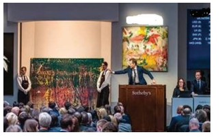

**In ‘Tight Corners’, E.V. Lucas narrates the story of how he was rescued from humiliation at an auction house, by a sudden stroke of luck. Let’s read on and get to know how he got himself in a tight corner and found his way out of that situation.**

 The talk was running on the critical situations in which we had found ourselves — those of us whose lives were adventurous enough to comprise any.

 One man had been caught by the tide in **Brittany** and escaped by the skin of his teeth. Another had been on an elephant when a wounded tiger charged at it. A third had been on the top storey of a burning house. A fourth was torpedoed in the War.

 “But you all talk,” said one of the company, “as though tight corners were always physical affairs. Surely they can be tighter when they are mental. The tightest corner I was ever in was at Christie’s.”

“Christie’s?”

 “Yes. I had been lunching rather well at a club in **St. James’s Street** with an old friend from abroad, and passing along **King Street** afterwards, he persuaded me to look in at the sale-room. The place was full.

They were selling Barbizon pictures, and getting tremendous sums for each: two thousand, three thousand, for little bits of things — forest scenes, pools at evening, shepherdesses, the regular subjects.

 Nothing went for three figures at all. Well, we watched for a little while and then I found myself bidding too just for fun. I had exactly sixty-three pounds in the bank and not enough securities to borrow five hundred on, and here I was nodding away to the auctioneer like a **bloatocrat.**

a) Describe the activity that was going on in the sale-room at King Street. 
b) What can you say about the author’s attitude when he high-handedly participated in the auction?

“You’ll get caught,”my friend said to me.
 “No, I shan’t,” I said. “I’m not going to run any risks.”

c) Why was the author sure he would not be caught?
 d) What made the author ignore his friend’s warning?

“And for a long time I didn’t. And then a picture was put up and a short red- faced man in a new top-hat — some well-known dealer — who had bought quite a number,**electrified** the room by starting the bidding at a figure a little higher than any that he had yet given or that anything had reached.

Although the previous lots had run into four figures they had all been modestly started at fifty guineas or a hundred guineas, with a gradual **crescendo** to which I had often been safely contributing. But no sooner was the new picture displayed than the dealer made his sensational bid, “Four thousand guineas,” he said.

e) How had the author managed the auction without getting involved in the deal?

There was a rustle of excitement, and at the end of it I heard my own voice saying, “And fifty!” A terrible silence followed, during which the auctioneer looked inquiringly first at the opener and then at the company generally.

 To my surprise and horror the redfaced dealer gave no sign of life. I realized now, as I ought to have done at first, that he had shot his bolt.

f ) What came as a shock to the author?

“Four thousand and fifty guineas offered”, said the auctioneer, again searching the room. 

My heart stopped; my blood **congealed**. There was no sound but a curious **smothered** noise from my friend. 

Four thousand and fifty guineas. Any advance on four thousand and fifty guineas? — and the hammer fell.

g) What did the falling of the hammer indicate?

That was a nice pickle to be in! Here was I, with sixty-three pounds in the world and not five hundred pounds’ worth of securities, the purchaser of a picture which I didn’t want, for four thousand and fifty guineas, the top price of the day.

 Turning for some kindly support to my friend I found that he had left me; but not, as I feared at the moment, from baseness, but, as I afterwards discovered, in order to find a remote place in which to lean against the hall and laugh.

h) What made the friend laugh heartily?

Stunned and dazed as I was, I pulled myself together sufficiently to hand my card, **nonchalantly** (I hope) to the clerk who came for the millionaire collector’s name, and then I set to pondering on the problem what to do next. Picture after picture was put up and sold, but I saw none of them. I was running over the names of uncles and other persons from whom it might be possible to borrow, but wasn’t; wondering if the moneylenders who talk so **glibly** about ‘**note of hand** only’ really mean it; speculating on the possibility of confessing my poverty to one of Christie’s staff and having the picture put up again. That was the best way — and yet how could I do it after all the other bids I had made? The staff looked so prosperous and unsympathetic, and no one would believe it was a mistake. A genuine mistake of such a kind would have been rectified at once.

i) What kind of excuses did the narrator think he could make?

Meanwhile the sale came to an end and I stood on the outskirts of the little knot of buyers round the desk who were writing cheques and giving instructions. Naturally I preferred to be the last. It was there that I was joined by my friend; but only for a moment, for on a look at my face he rammed his handkerchief in his mouth and again disappeared. Alone I was to **dree this awful weird**. I have never felt such a fool or had colder feet in all my life. I believe I should have welcomed a firing party.

j) Why did the friend desert the narrator, a second time?

And then the unexpected happened, and I realized that a career of **rectitude** sometimes has rewards beyond the mere consciousness of virtue. A voice at my ear suddenly said, ‘Beg pardon. Sir, but was you the gent that bought the big Daubigny?”

 I admitted it.

 “Well, the gent who offered four thousand guineas wants to know if you’ll take fifty guineas for your bid.” 

If ever a messenger of the high gods wore a green **baize** apron and spoke in husky Cockney tones this was he. I could have embraced him and wept for joy. Would I take fifty guineas. Why, I would have taken fifty **farthings**.

k) How does the narrator describe the man who approached him?

But how near the surface and ready, even in the best of us, is worldly **guile**! “Is that the most he would offer?” I had the presence of mind to ask.

 “It’s not for me to say,” he replied. “No ‘arm in trying for a bit more, is there?”

 “Tell him I’ll take a hundred,” I said. And I got it.

l) How does the Narrator show presence of mind in the sudden turn of events?

When I found my friend I was laughing too, but he became grave at once on seeing the cheque. “Well, I’m hanged!”

 he said. “Of all the luck! Well, I’m hanged!” Then he said, “Don’t forget that if it hadn’t been for me, you wouldn’t have come into Christie’s at all.” “I shall never forget it,” I said. “It is **indelibly** branded in letters of fire on my heart. My hair hasn’t gone white, has it?”

m) The narrator would not forget two things about his friend. What are they?

**About The Author**

**Edward Verrall Lucas, (1868 – 1938)** was an English
humorist, essayist, playwright, biographer, publisher,
poet, novelist, short story writer and editor. Born to
a Quaker family on the fringes of London, Lucas began
work at the age of sixteen, apprenticed to a
bookseller. After that he turned to journalism, and
worked on a local paper in Brighton and then on a
London evening paper. He was commissioned to write a
biography of Bernard Barton, the Quaker poet. This led
to further commissions, including the editing of the
works of Charles Lamb. Lucas joined the staff of the
humorous magazine Punch in 1904, and remained there
for the rest of his life. He was a prolific writer
most celebrated for his short essays, but he also
produced verses, novels and plays.

