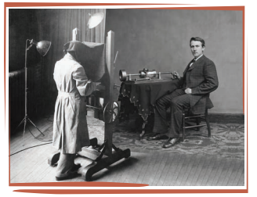

**Here is a story ‘With the Photographer’ where the narrator visits a studio to have his photograph taken. His experience with the professional photographer turns out to be an unforgettable one**

“I want my photograph taken,” I said. The photographer looked at me without enthusiasm. He was a **drooping** man in a gray suit, with the dim eye of a natural scientist. But there is no need to describe him. Everybody knows what a photographer is like.

 “Sit there,” he said, “and wait.”

 I waited an hour. I read the Ladies Companion for 1912, the Girls Magazine for 1902 and the Infants Journal for 1888. I began to see that I had done an **unwarrantable** thing in breaking in on the privacy of this man’s scientific **pursuits** with a face like mine.

 After an hour the photographer opened the inner door.

 “Come in,” he said severely. 

I went into the studio. “Sit down,” said the photographer.

 I sat down in a beam of sunlight filtered through a sheet of factory cotton hung against a frosted skylight.

 The photographer rolled a machine into the middle of the room and crawled into it from behind.

 He was only in it a second,–just time enough for one look at me,–and then he was out again, tearing at the cotton sheet and the window panes with a hooked stick, apparently **frantic** for light and air.

Then he crawled back into the machine again and drew a little black cloth over himself. This time he was very quiet in there. I knew that he was praying and I kept still.

When the photographer came out at last, he looked very **grave** and shook his head.

 “The face is quite wrong,” he said.

 “I know,” I answered quietly; “I have always known it.”

 He sighed.

 “I think,” he said, “the face would be better three-quarters full.”

 “I’m sure it would,” I said enthusiastically, for I was glad to find that the man had such a human side to him. “So would yours. In fact,” I continued, “how many faces one sees that are apparently hard, narrow, limited, but the minute you get them three-quarters full they get wide, large, almost **boundless** in–”

 But the photographer had **ceased** to listen. He came over and took my head in his hands and twisted it sideways. I thought he meant to kiss me, and I closed my eyes.

 But I was wrong.

 He twisted my face as far as it would go and then stood looking at it.

He sighed again.

 “I don’t like the head,” he said. 

Then he went back to the machine and took another look.

 “Open the mouth a little,” he said.

 I started to do so.

 “Close it,” he added quickly.

 Then he looked again.

 “The ears are bad,” he said; “droop them a little more. Thank you. Now the eyes. Roll them in under the lids. Put the hands on the knees, please, and turn the face just a little upward. Yes, that’s better. Now just expand the lungs! So! And hump the neck–that’s it–and just contract the waist–ha!–and twist the hip up toward the elbow–now! I still don’t quite like the face, it’s just a **trifle** too full, but–”

 I swung myself round on the stool. 

“Stop,” I said with emotion but, I think, with dignity. “This face is my face. It is not yours, it is mine. I’ve lived with it for forty years and I know its faults. I know it’s out of drawing. I know it wasn’t made for me, but it’s my face, the only one I have–” I was conscious of a break in my voice but I went on–”such as it is, I’ve learned to love it. And this is my mouth, not yours. These ears are mine, and if your machine is too narrow–” Here I started to rise from the seat.

Snick!

The photographer had pulled a string. The photograph was taken. I could see the machine still **staggering** from the shock. 

“I think,” said the photographer, pursing his lips in a pleased smile, “that I caught the features just in a moment of **animation**.”

 “So!” I said bitingly,– “features, eh? You didn’t think I could animate them, I suppose? But let me see the picture.”

 “Oh, there’s nothing to see yet,” he said, “I have to develop the negative first. Come back on Saturday and I’ll let you see a proof of it.”

 On Saturday I went back.

 The photographer **beckoned** me in. I thought he seemed quieter and graver than before. I think, too, there was a certain pride in his manner.

 He unfolded the proof of a large photograph, and we both looked at it in silence. 

“Is it me?” I asked.

 “Yes,” he said quietly, “it is you,” and we went on looking at it.

“The eyes,” I said hesitatingly, “don’t look very much like mine.”

 “Oh, no,” he answered, “I’ve retouched them. They come out splendidly, don’t they?”

 “Fine,” I said, “but surely my eyebrows are not like that?”

 “No,” said the photographer, with a momentary glance at my face, “the eyebrows are removed. We have a process now–the Delphide–for putting in new ones. You’ll notice here where we’ve applied it to carry the hair away from the brow. I don’t like the hair low on the skull.” 

“Oh, you don’t, don’t you?” I said.

 “No,” he went on, “I don’t care for it. I like to get the hair clear back to the **superficies** and make out a new brow line.

” “What about the mouth?” I said with a bitterness that was lost on the photographer, “is that mine?”

 “It’s adjusted a little,” he said, “yours is too low. I found I couldn’t use it.” 

“The ears, though,” I said, “strike me as a good likeness; they’re just like mine.” 

“Yes,” said the photographer thoughtfully, “that’s so; but I can fix that all right in the print. We have a process now–the Sulphide– for removing the ears entirely. I’ll see if–”

 “Listen!” I interrupted, drawing myself up and animating my features to their full extent and speaking with a **withering scorn** that should have blasted the man on the spot. “Listen! I came here for a photograph– a picture–something which (mad though it seems) would have looked like me. I wanted something that would **depict** my face as Heaven gave it to me, humble though the gift may have been. I wanted something that my friends might keep after my death, to **reconcile** them to my loss. It seems that I was mistaken. What I wanted is no longer done. Go on, then, with your brutal work. Take your negative, or whatever it is you call it–dip it in sulphide, bromide, oxide, cowhide–anything you like–remove the eyes, correct the mouth, adjust the face, restore the lips, reanimate the necktie and reconstruct the waistcoat. Coat it with an inch of gloss, shade it, **emboss** it, gild it, till even you acknowledge that it is finished. Then when you have done all that–keep it for yourself and your friends. They may value it. To me it is but a worthless **bauble**.” I broke into tears and left.

**About The Author**

**Stephen P. H. Butler Leacock – FRSC (1869 – 1944
**was a Canadian teacher, Political Scientist, Writer
and Humourist. He was educated at Upper Canada College
in Toronto and the University of Toronto from which he
graduated in 1891. He received a Fellowship in
Political Economy and took his Ph.D. in 1903. Between
the years 1915 and 1925, he was the best known English
speaking humorist in the world. He is known for his
light humour along with criticism of people’s follies
Sunshine Sketches of a Little Town, Arcadian
Adventures, With the
